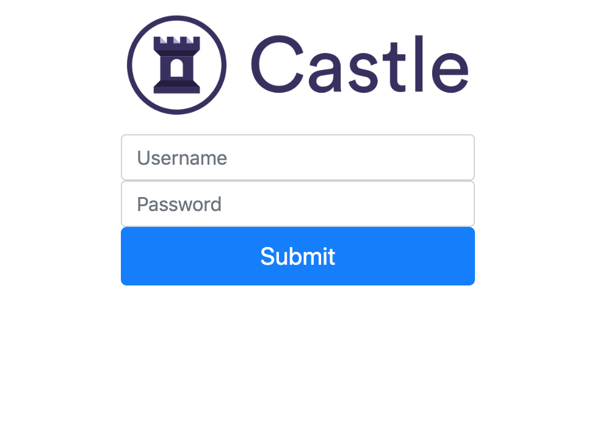

# Simple Authentication Challenge
 This is part one of the coding challeing for the Solutions Engineer position at Castle.

## Getting Started
To view project, first clone this repository. Next in the terminal run the following commands `npm install package.json` and  `npm run dev`. Open `http://localhost:3000/` in your browser to view. 

