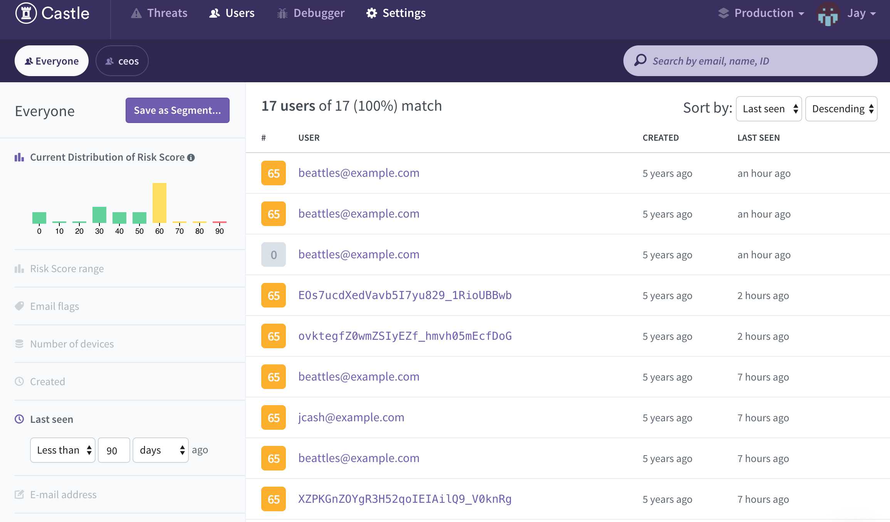

# Simple Authentication Challenge - Castle Integration
 This is part two of the coding challenge which builds on top of part one and includes Castle authenticate events. Login attempts can now be viewed in the Castle dashboard.

## Getting Started
To view project, first clone this repository. Next in the terminal run the following commands `npm install package.json` and  `npm run dev`. Open `http://localhost:3000/` in your browser to view.

